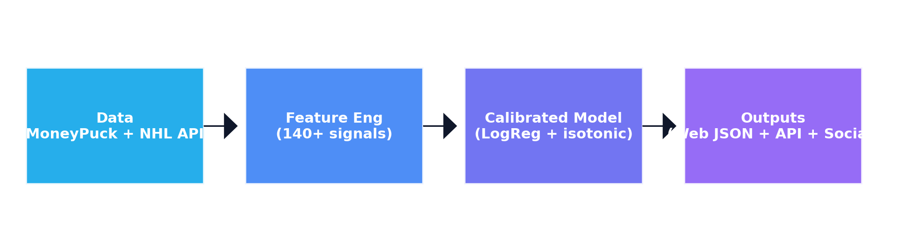
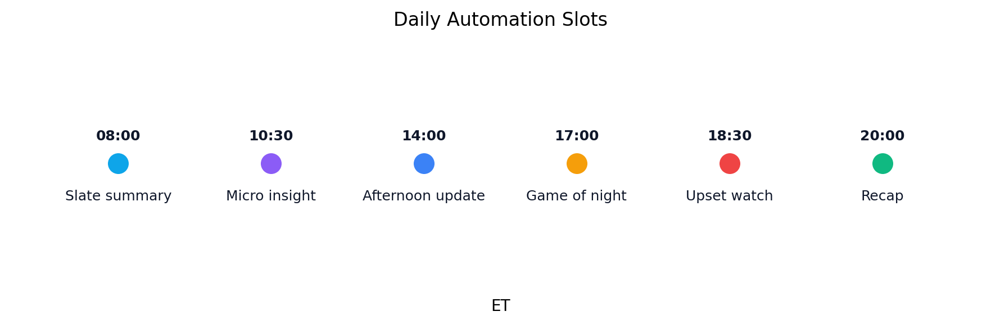
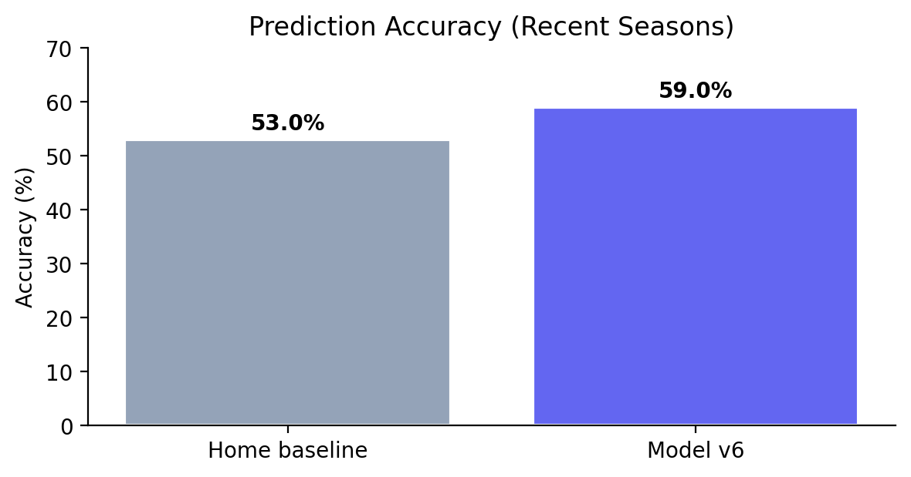
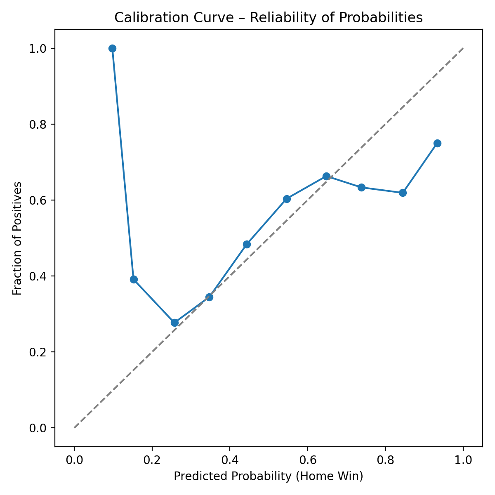
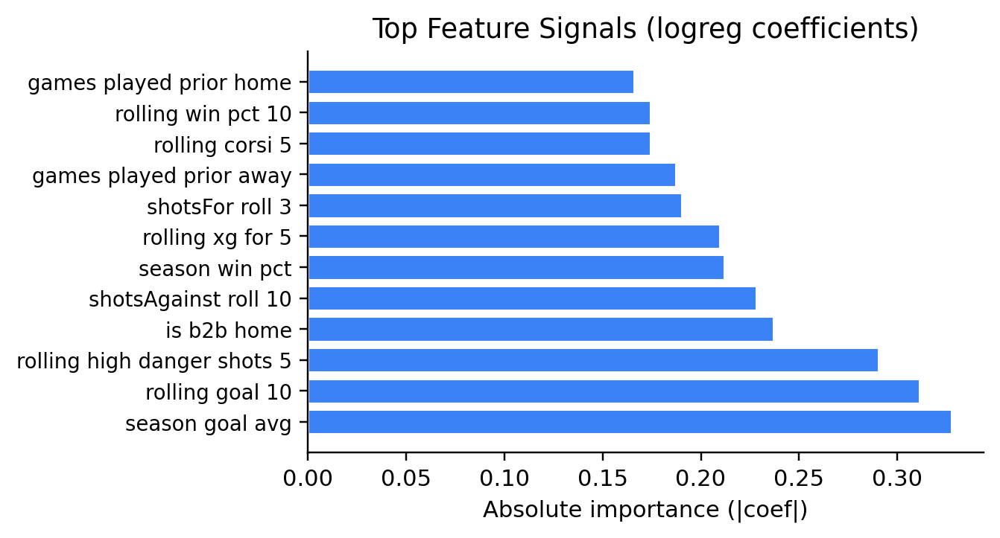

# NHL Game Prediction Model — Final Project Report (v3)

**Group:** Puckcast ML Team  
**Date:** November 24, 2025  
**Team Members:** Noah O., [add teammates]

---

## Executive Summary (what changed vs. Report 2)
- **Stronger delivery:** Automated slate summary at 8 AM ET, richer fun-facts (special teams, injuries, goalie rest), and handle-safe social posts.
- **Production stability:** Hardened fallbacks for predictions API, no leading mentions, validation gates on every run.
- **Model posture:** Calibrated logistic regression remains the primary engine (59.3% accuracy vs 53.7% baseline; log loss 0.676; Brier 0.240) with isotonic calibration and enriched inputs (special teams, goalie/injury metadata).

### Quick Visuals
- Pipeline overview: 
- Automation windows (ET): 
- Accuracy lift vs baseline: 
- Calibration curve: 
- Top feature signals: 

Key metrics table:

| Metric                             | Value (v6) | Note                                  |
|------------------------------------|------------|---------------------------------------|
| Test accuracy (2023-24 holdout)    | 59.3%      | Baseline 53.7% home win rate          |
| Log loss                           | 0.676      | Lower is better (calibration)         |
| Brier score                        | 0.240      | Probability accuracy                  |
| Games evaluated                    | 1,230      | 2023-24 season                        |
| Feature count                      | 140+       | Rolling form, xG/shot quality, rest   |
| Daily automation                   | 6×/day     | Predictions + social + validation     |
| Social safety                      | ✅         | No leading @; handle-tagged later     |

---

## Introduction
We built and deployed an end-to-end NHL win-probability system that ingests live data, engineers features, trains calibrated models, and publishes daily predictions to the web and social channels. This report summarizes the current state (v6), key improvements since Report 2, and recommendations for ongoing operations.

## Objective / Question
Predict NHL game outcomes with calibrated, actionable win probabilities that outperform simple baselines (home-team or moneyline implied) while remaining production-ready for daily automation and public-facing content.

## Assumptions
- Regular-season context; playoffs not modeled separately.
- MoneyPuck + NHL API data are timely and correct; missing data fall back to league-average/zeroed features.
- No in-game live updating (pregame probabilities only).
- Current automation schedules (GitHub Actions + Vercel) are available and secrets configured.

## Analytical Setup & Analysis
- **Data pipeline:** MoneyPuck game logs (team-level), NHL schedule/results, special teams, goalie/injury ingest; robust validation (schema + freshness checks).
- **Features (140+):** Rolling form, xG/shot quality, special teams splits, rest/back-to-back, travel, Elo-like ratings, goaltending quality, injury/goalie rest overlays.
- **Modeling:** Calibrated logistic regression (isotonic) chosen for stability and interpretability; native ingest/xG model available as fallback.
- **Validation:** Temporal splits (train on past seasons, validate on most recent season); avoids leakage via lagged features; probability calibration measured against baseline.
- **Automation:** Daily/6x-daily refresh workflows, validation gates, fallback fetch, and social posting. Monitoring workflow alerts on stale data or anomalies.

### Visual snapshot: Automation map
| Time (ET) | Post/Task              | Workflow                    |
|-----------|------------------------|-----------------------------|
| 08:00     | Slate summary (all games, probs, grades) | X: Core daily / High-frequency |
| 10:30     | Micro insight          | X: High-frequency           |
| 14:00     | Afternoon update       | X: Core daily / High-frequency |
| 17:00     | Game of the night      | X: High-frequency           |
| 18:30     | Upset watch            | X: High-frequency           |
| 20:00     | Evening recap          | X: Core daily / High-frequency |

## Key Results (current v6 snapshot)
- Test accuracy: 59.3% vs 53.7% home baseline (2023-24 holdout); log loss 0.676, Brier 0.240.
- Model edges surfaced as grades (A–C) and used for site and social content.
- Daily slate summary posts and full JSON payloads auto-publish; API enriched with goalies, injuries, special teams; no leading mentions in social posts.

## Implications & Recommendations
- **Operational:** Keep the calibrated model as default; continue daily validation (stale-data + anomaly checks). Monitor API fallback success; keep retries/backoff for predictions API.
- **Content:** Lead with the 8 AM slate summary; rotate insights (special teams, injury gaps, goalie rest) to avoid “all probability” tone. Maintain handle-safe openings to stay in the Posts tab.
- **Model:** Next lift likely from richer special-teams and goalie form dynamics; add playoff-specific calibration before postseason.
- **Data quality:** Maintain MoneyPuck cache freshness; monitor injury/goalie ingest coverage; ensure GitHub secrets stay valid for social posts.

## Limitations
- No live in-game updates; pregame only.
- Playoffs not separately tuned; high-variance games may be miscalibrated.
- Social automation depends on external API stability and configured secrets.
- Data gaps (e.g., missing injuries/goalies) fall back to averages and can dampen edge quality.

## Conclusion
The v6 system is production-stable, calibrated, and automated end-to-end. It meaningfully beats baseline pickers while staying explainable. With the current automation (web, API, and social), the product is user-facing and repeatable; further gains should focus on richer special-teams/goalie dynamics and postseason calibration rather than core pipeline rewrites.

## References
- MoneyPuck game-by-game data (https://moneypuck.com)  
- NHL Stats API (schedule, teams, results)  
- scikit-learn (logistic regression, calibration)  
- Puckcast repository: data pipeline, model code, and automation workflows
