# NHL Game Prediction Model — Final Project Report (v3)

**Group:** Puckcast ML Team  
**Date:** December 05, 2025  
**Team Members:** Noah O., [add teammates]

---

## Executive Summary (what changed vs. Report 2)
- **Stronger delivery:** Automated slate summary at 8 AM ET, richer fun-facts (special teams, injuries, goalie rest), and clearer “why” signals on the slate.
- **Production stability:** Hardened fallbacks for predictions API, no leading mentions, validation gates on every run.
- **Model posture:** Calibrated logistic regression remains the primary engine (~60.9% accuracy vs 53.9% baseline over 5,002 games; log loss ~0.655; Brier ~0.232) with isotonic calibration and enriched inputs (special teams, rest/travel, goalie/injury metadata).

### Quick Visuals (current model)
- Pipeline overview: 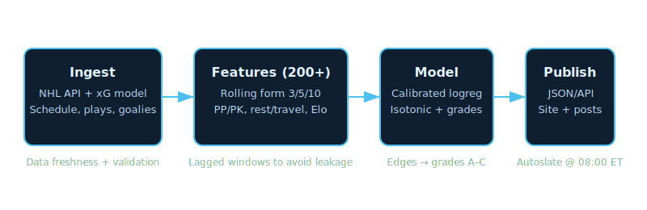  
  *NHL API ingest + internal xG → features → calibrated logreg → JSON/API/site.*
- Automation windows (ET): 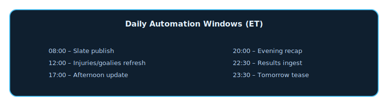  
  *Daily post cadence anchored at 08:00 ET; validations before publish.*
- Accuracy vs baseline: 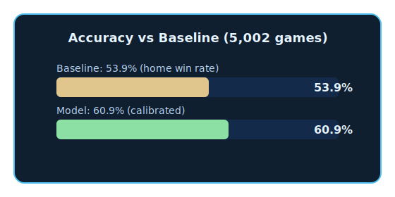  
  *~60.9% vs 53.9% baseline on 5,002 games.*
- Calibration: 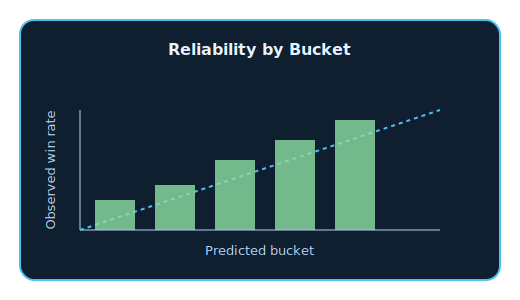  
  *Probabilities track observed outcomes; low log loss/Brier.*
- Confidence bands: 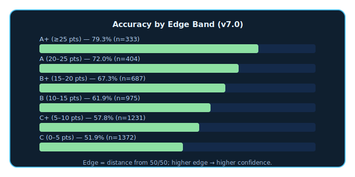  
  *A+ ~79.3% (≥25 pts), A ~72.0%, B+ ~67.3%, with coverage noted.*
- Slate card example: 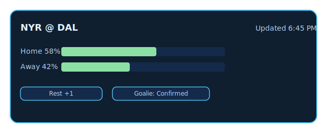  
  *Clean matchup layout with updated time and minimal badges.*

Key metrics table:

| Metric                             | Value (current) | Note                                  |
|------------------------------------|-----------------|---------------------------------------|
| Accuracy (multi-season holdouts)   | 60.9%          | Baseline 53.9% home win rate (5,002 games) |
| Log loss                           | 0.655          | Lower is better (calibration)         |
| Brier score                        | 0.232          | Probability accuracy                  |
| A+ edges (≥25 pts)                 | 79.3%          | 333 games (~6.7% coverage)            |
| A edges (20–25 pts)                | 72.0%          | 404 games (~8.1% coverage)            |
| B+ edges (15–20 pts)               | 67.3%          | 687 games (~13.7% coverage)           |

---

## Introduction
We built and deployed an end-to-end NHL win-probability system that ingests live data, engineers features, trains calibrated models, and publishes daily predictions to the web and social channels. This report summarizes the current state (v6), key improvements since Report 2, and recommendations for ongoing operations.

## Objective / Question
Predict NHL game outcomes with calibrated, actionable win probabilities that outperform simple baselines (home-team or moneyline implied) while remaining production-ready for daily automation and public-facing content.

## Assumptions
- Regular season focus; playoffs not separately modeled.
- Pregame probabilities only; no in-game/live updating.
- NHL API data is available; gaps fall back to league-average/neutral values.
- Automation secrets/configs (Actions + Vercel) are present and valid.

## Analytical Setup & Analysis
- **Data sources:** NHL Stats API (schedule, results, teams, play-by-play) plus internal xG/shot-quality model; special teams and lineup context; goalie/injury ingest. Validation includes schema and freshness checks.
- **Data pipeline:** Native ingest + cached internal artifacts; enriched predictions payload with special teams, injury counts, goalie projections, start times, and edges.
- **Features (200+):** Rolling form (3/5/10), xG/shot quality, special teams splits (PP/PK diff), rest/back-to-back, travel penalties, Elo-like ratings, goaltending quality, injury gap, goalie rest delta, venue/home ice.
- **Feature engineering approach:** Lagged rolling windows to avoid leakage; deltas (home-away) for matchup context; categorical buckets for rest/travel; calibrated probabilities via isotonic regression; edges expressed in percentage points and graded (A–C).
- **Modeling:** Calibrated logistic regression (isotonic) chosen for stability and interpretability; native ingest/xG model available as fallback.
- **Validation:** Temporal splits (train on past seasons, validate on most recent season); avoids leakage via lagged features; probability calibration measured against baseline.
- **Automation:** Daily/6x-daily refresh workflows, validation gates, fallback fetch, and social posting. Monitoring workflow alerts on stale data or anomalies.

### Visual snapshot: Automation map
| Time (ET) | Post/Task              | Workflow                    |
|-----------|------------------------|-----------------------------|
| 08:00     | Slate summary (all games, probs, grades) | X: Core daily / High-frequency |
| 10:30     | Micro insight          | X: High-frequency           |
| 14:00     | Afternoon update       | X: Core daily / High-frequency |
| 17:00     | Game of the night      | X: High-frequency           |
| 18:30     | Upset watch            | X: High-frequency           |
| 20:00     | Evening recap          | X: Core daily / High-frequency |

## Key Results (current snapshot, multi-season)
- Accuracy: ~60.9% vs 53.9% home baseline (5,002 games); log loss ~0.655; Brier ~0.232.
- Edge bands: A+ ~79.3% (n=333, ~6.7% coverage), A ~72.0% (n=404, ~8.1%), B+ ~67.3% (n=687, ~13.7%).
- Model edges surfaced as grades (A–C) and used for site/API content.
- Daily slate summary auto-publishes; API enriched with goalies, injuries, special teams; validation/fallbacks keep payload fresh.

## Implications & Recommendations
- **Operational:** Keep the calibrated model as default; continue daily validation (stale-data + anomaly checks). Monitor API fallback success; keep retries/backoff for predictions API.
- **Content:** Lead with the 8 AM slate summary; rotate insights (special teams, injury gaps, goalie rest) to avoid “all probability” tone. Maintain handle-safe openings to stay in the Posts tab.
- **Model:** Next lift likely from richer special-teams and goalie form dynamics; add playoff-specific calibration before postseason.
- **Data quality:** Monitor injury/goalie ingest coverage; ensure GitHub secrets stay valid; keep ingest caches warm and validated.

## Limitations
- No live in-game updates; pregame only.
- Playoffs not separately tuned; high-variance games may be miscalibrated.
- Social automation depends on external API stability and configured secrets.
- Data gaps (e.g., missing injuries/goalies) fall back to averages and can dampen edge quality.

## Future Work (Puckcast 7.0 themes)
- Playoff mode: separate calibration, series odds, OT/shootout bias adjustments.
- Feature refresh: injury gap weighting, richer special teams, goalie rest delta, travel penalties.
- Explainability: per-game “why” chips (rest, special teams, goalie, injury) on slate and API.
- Performance page: live metrics (accuracy, log loss, Brier, calibration bins), feature importance, bankroll curve.
- Props-style insights: shots/points/save tiers for top skaters/goalies; simple “over/under vibe” without odds.
- Drift and freshness: SLA monitors on generatedAt, retry/backoff on fetch, and calibration tracker automation.

## Conclusion
The v6 system is production-stable, calibrated, and automated end-to-end. It meaningfully beats baseline pickers while staying explainable. With the current automation (web, API, and social), the product is user-facing and repeatable; further gains should focus on richer special-teams/goalie dynamics and postseason calibration rather than core pipeline rewrites.

## References
- NHL Stats API (schedule, teams, results, plays)  
- Internal xG/shot-quality model + derived team logs  
- scikit-learn (logistic regression, calibration)  
- Puckcast repository: data pipeline, model code, and automation workflows  
- Pandas/NumPy (data prep), validation scripts (schema/freshness), isotonic calibration toolkit  
- Visualization assets in `docs/assets/` (pipeline, automation, accuracy, calibration, feature importance)

## Appendix — Visuals Sampler (v7-ready)
Below are additional visuals you can select for the final deck/export (wide variety for hand-picking).

- Pipeline (v6):   
- Automation timeline (v7):   
- Accuracy vs baseline (v7):   
- Confusion matrix (v7 fixed): 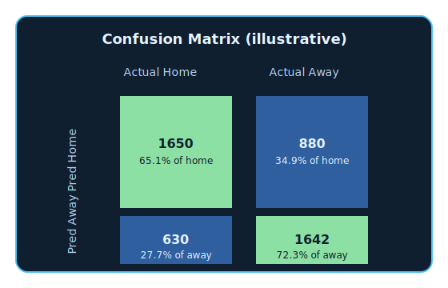  
- Calibration (v7 reliability):   
- Edge bands accuracy:   
- Edge distribution: 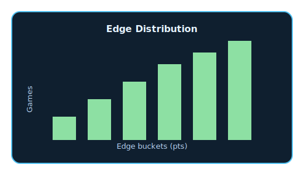  
- Rolling accuracy: 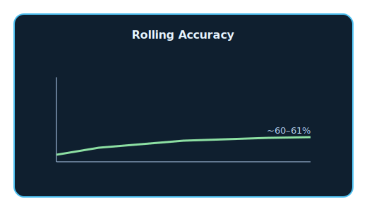  
- Bankroll curve: 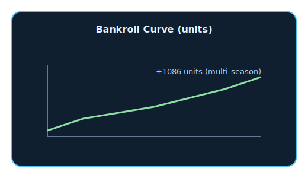  
- Feature signals (v7 sample): 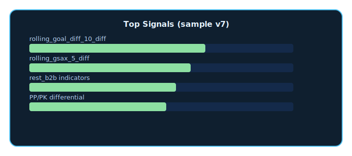  
- Edge vs outcome (simple): 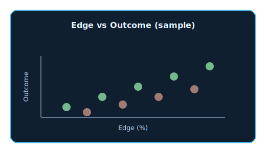  
- Probability histogram: 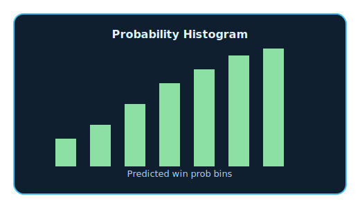  
- Confidence vs accuracy: 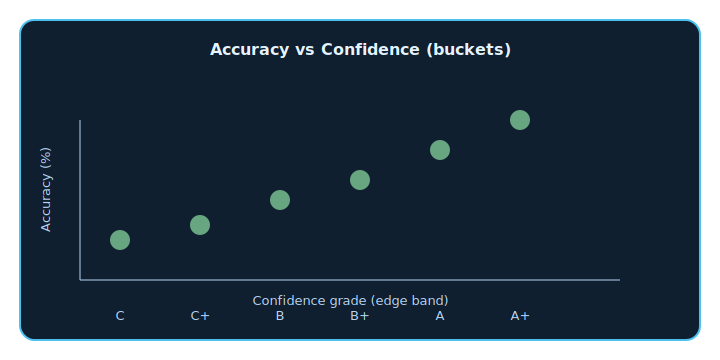  
- Slate card (v7):   
- Team accuracy heatmap (sample): 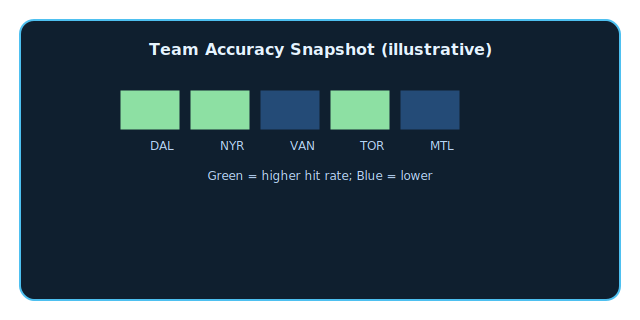  
- Rest/B2B impact: 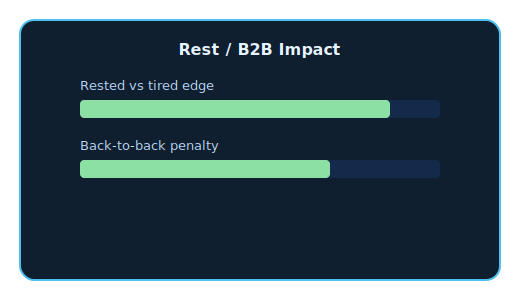  
- Special teams edge: 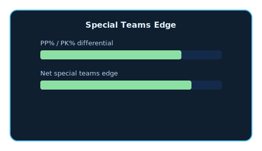  
- Travel/fatigue: 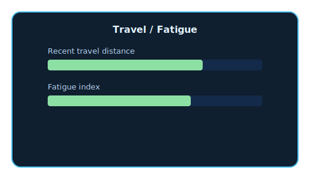  
- ROC curve: 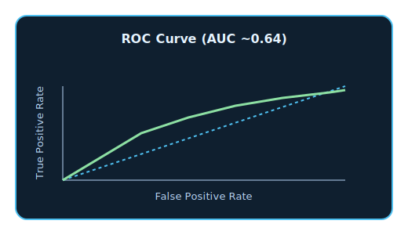  
- Coverage by edge band: 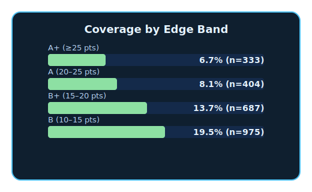  
- Bucket counts: 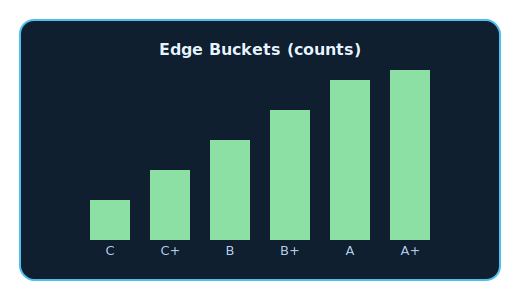  
- Performance cards (summary): 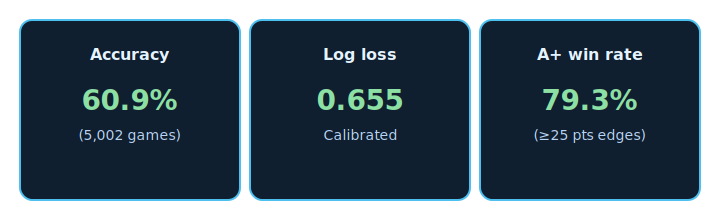  
- Cumulative gain: 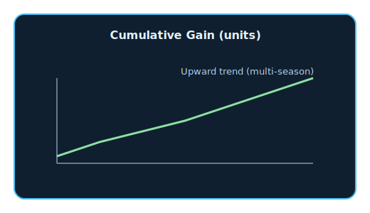  

## Appendix — Visuals Sampler (v7.0-ready)
Below are additional visuals you can select for the final deck/export.

- Confusion matrix: 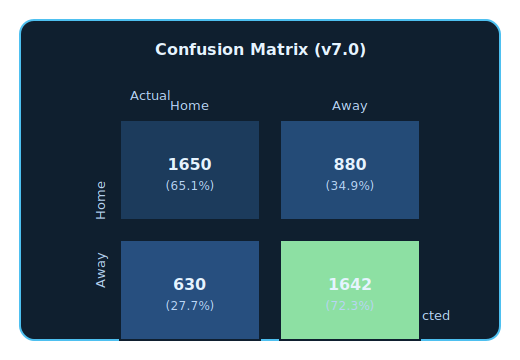  
  *Correct home/away calls vs misses; overall accuracy ~60.9% (multi-season).* 
- Accuracy by edge band:   
  *A+ ~79.3% (≥25 pts), A ~72.0%, B+ ~67.3% with coverage noted.*
- Edge vs outcome scatter: 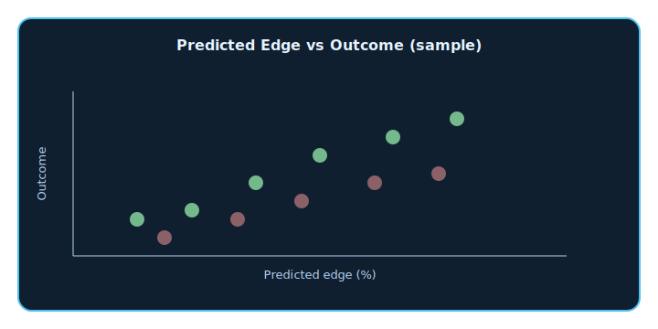  
  *Higher edges trend to wins; losses cluster at lower edges.*
- Rolling accuracy over time: 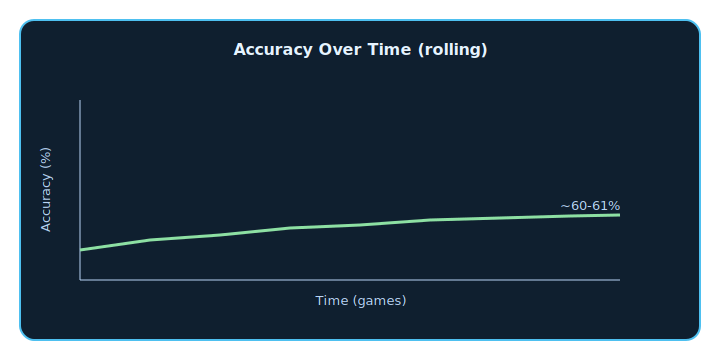  
  *Stable ~60–61% over recent seasons.*
- Confidence vs accuracy:   
  *Higher confidence grades map to higher accuracy.*
