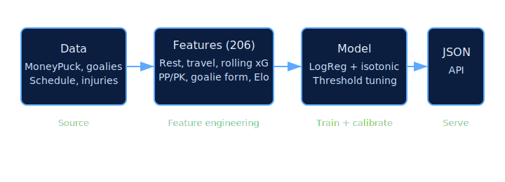
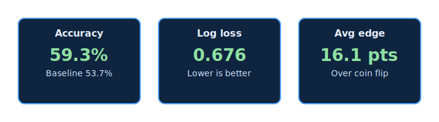
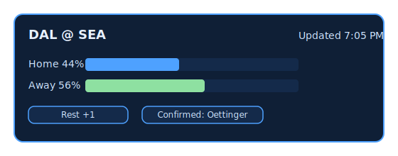
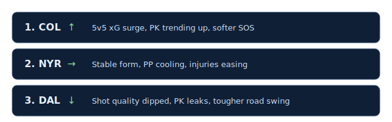
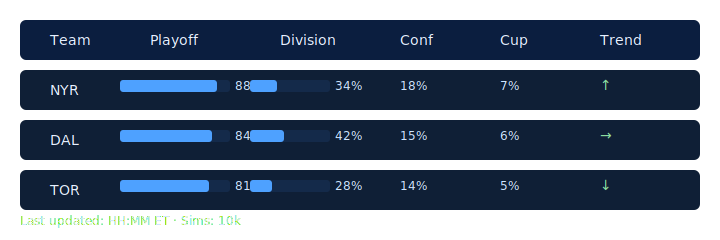
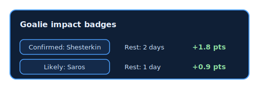
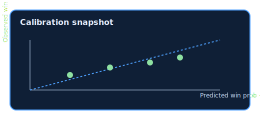
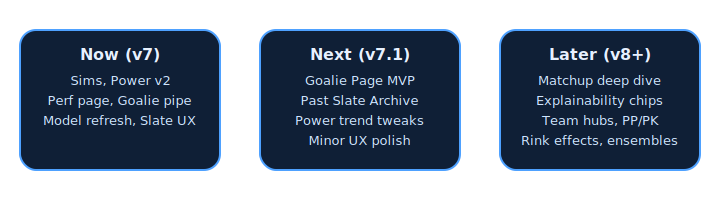
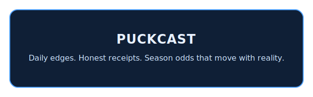

# Puckcast: Turning Hockey Chaos into Signal

Story-first outline for a <10 minute deck. Copy is ready to paste; visuals are described with quick prompts. This is tailored for a sports analytics class: emphasize the process, modeling decisions, and the product impact. Keep URLs out of main slides; use clean visuals.

---

### Slide 1 — Why We Built Puckcast
**Copy:**  
Hockey is noisy. Odds swing with goalies, travel, and back-to-backs. We built Puckcast to turn daily chaos into clean, trustworthy probabilities.

**Visual (copy-paste SVG-ready mock):**
```
Goalie in crease + overlay:
[GOALIE SILHOUETTE]
│  Metrics Overlay  │
│  Save%  .914      │
│  xG diff +0.23    │
│  Rest 1 day       │
```

---

### Slide 2 — Our Signal
**Copy:**  
Behind every prediction: 206 engineered features—rest, travel, rolling xG, special teams, goalie form, Elo. Trained on the last 3 seasons, calibrated to match real outcomes.

**Visual (flow diagram):**

```
Data
│
├─ MoneyPuck team games
├─ Goalie feeds
└─ Schedule/injuries
      │
      ▼
Features (206)
│ rest, travel, rolling xG, PP/PK, goalie form, Elo
      │
      ▼
Model
│ LogReg + isotonic
│ + threshold tuning
      │
      ▼
Outputs
├─ JSON (predictions, sims)
└─ Site (/predictions, /power, /season)
```

---

### Slide 3 — Performance, Right Now
**Copy:**  
Holdout accuracy: 59.3% (vs 53.7% baseline). Log loss: 0.676, Brier: 0.240. Average edge: 16.1 pts over a coin flip.

**Visual (metrics cards):**

```
[Accuracy]
  59.3%  vs  53.7% baseline

[Log loss]
  0.676 (lower is better)

[Avg edge]
  16.1 pts over coin flip
  |##########------|
```

---

### Slide 4 — Daily Slate Experience
**Copy:**  
Clean, fast, scannable. We strip the clutter: updated timestamp, refined bars, 1–2 badges max (rest/goalie/injury).

**Visual (before/after cards):**

```
Before (cluttered)
DAL @ SEA | 44% / 56% | Edge: -2.6 pts
[chips][chips][chips] lorem ipsum summary

After (clean)
DAL @ SEA      Updated 7:05 PM
Home 44%  | Away 56%
Badges: [Rest +1] [Confirmed: Oettinger]
```

---

### Slide 5 — Explainability Where It Matters (Power v2)
**Copy:**  
Power Index v2 pairs movement arrows with 1–2 sentences on why: recent form, special teams, injuries, shot quality, strength of schedule.

**Visual (rank rows):**

```
1. COL  ↑  "5v5 xG surge, PK trending up, softer SOS"
2. NYR  →  "Stable form, PP cooling, injuries easing"
3. DAL  ↓  "Shot quality dipped, PK leaks, tougher road swing"
```

---

### Slide 6 — Season Storylines (Sim Engine)
**Copy:**  
Daily simulations (5k–20k runs) give playoff/division/conference/Cup odds. One page, last-updated stamp, and probability bars you can trust.

**Visual (table snippet):**

```
Team   Playoff   Division   Conf   Cup   Trend
NYR    88% ██████████░░      34%    18%   7%    ↑
DAL    84% █████████░░░      42%    15%   6%    →
TOR    81% ████████░░░░      28%    14%   5%    ↓
(last updated: HH:MM ET, sims: 10k)
```

---

### Slide 7 — Goalies: The Swing Factor
**Copy:**  
We pull expected/confirmed starters, rest, and inject goalie strength into the model. Light badges show “Confirmed” or “Likely” so edges aren’t blind to the crease.

**Visual (badge examples):**

```
Confirmed: Shesterkin  | Likely: Saros
Rest: 2 days           | Rest: 1 day
Impact: +1.8 pts       | Impact: +0.9 pts
```

---

### Slide 8 — Performance Receipts
**Copy:**  
7-day and season accuracy at a glance. A hits/misses strip for the last 20–30 games. One calibration/reliability glimpse—no black boxes.

**Visual (mini dashboard):**


```
7-day accuracy: 61.5%   Season: 59.3%
Hits (last 5):  NYR>CAR, PIT>BUF, TOR>CBJ, DAL>SEA, CGY>TBL
Misses (last 5): STL<NJD, VAN<ANA, OTT<VGK, PHI<FLA, MIN<CHI
Calibration (sketch):
Observed win rate
^
|    *      *
| *        *
|   *   *
|______Predicted win prob→
```

---

### Slide 9 — Stability Under the Hood
**Copy:**  
Anti-stale checks. Timestamp validation. Retry logic on ingest. JSON completeness checks. We hardened the pipeline so you get fresh data, not surprises.

**Visual (checklist):**
```
[x] Anti-stale timestamps on predictions
[x] Retry logic on ingest (NHL API)
[x] JSON completeness validation
[x] Freshness checks before publish
```

**What went wrong / how we fixed it (bullet story):**
- Problem: stale or missing JSON during early morning posts.
- Fix: anti-stale timestamp checks + retry logic; enforce completeness validation before publish.
- Result: daily slate posts without manual babysitting.

---

### Slide 10 — Next Up (v7.1 Targets)
**Copy:**  
Goalie Page MVP. Past Slate Archive. Extra trend indicators for Power Index. Minor UX polish.

**Visual (roadmap bar):**

```
Now (v7): Sims | Power v2 | Perf page | Goalie pipeline | Model refresh | Slate UX
Next (v7.1): Goalie Page MVP | Past Slate Archive | Power trend tweaks | Minor UX
Later (v8+): Matchup deep dive | Explainability chips | Team hubs | PP/PK | Rink effects
```

---

### Slide 11 — Impact in Plain Language
**Copy:**  
For fans: faster, clearer edges.  
For analysts: calibrated probabilities with traceable factors.  
For the product: reliability + richer season context (sim engine + Power v2).

**Visual prompt:**  
Three benefit cards.

**Mini-case (marquee edge narrative, optional):**
```
Game: DAL @ SEA
Edge drivers: goalie rest (+1), rolling xG edge (DAL), travel neutral, special teams slight tilt.
Model favorite: DAL 56%, edge 6 pts over coin flip.
```

---

### Slide 12 — Close
**Copy:**  
Hockey is chaos; Puckcast makes it legible. Daily edges, honest receipts, and season odds that update with reality.

**Visual (closing card):**

```
PUCKCAST
Daily edges. Honest receipts. Season odds that move with reality.
```

---

## Visual Stubs (lightweight markdown “images” you can drop in slides)

Ready-to-use assets (SVG) in `docs/assets/presentation/`:
- `flow.svg`
- `metrics.svg`
- `prediction_card.svg`
- `power_rows.svg`
- `sims_table.svg`
- `goalie_badges.svg`
- `calibration.svg`
- `recap_cards.svg`
- `roadmap.svg`
- `closing.svg`

**Slide 2 — Flow diagram:**
```
Data (MoneyPuck, Goalie pulls) → Features (rest/travel/xG/special teams/goalie/Elo) → Model (LogReg + isotonic) → JSON/API → Site
```

**Slide 3 — Performance cards:**
```
| Accuracy | Baseline |
| 59.3%    | 53.7%    |

| Log loss | Brier | Avg edge |
| 0.676    | 0.240 | 16.1 pts |
```

**Slide 4 — Prediction card (clean slate):**
```
DAL @ SEA   Updated 7:05 PM
Home 44%  | Away 56%
Badges: [Rest +1] [Confirmed: Oettinger]
```

**Slide 5 — Power v2 row:**
```
2. Rangers  ↑
Why: strong 5v5 form, PK > league, shot quality edge vs SOS.
```

**Slide 6 — Season sims table snippet:**
```
Team   Playoff   Division   Conf   Cup   Trend
NYR    88%       34%        18%    7%    ↑
DAL    84%       42%        15%    6%    →
TOR    81%       28%        14%    5%    ↓
(last updated: HH:MM ET, sims: 10k)
```

**Slide 8 — Performance snippet:**
```
7-day: 61.5%   Season: 59.3%
Hits (last 5): NYR>CAR, PIT>BUF, TOR>CBJ, DAL>SEA, CGY>TBL
Misses (last 5): STL<NJD, VAN<ANA, OTT<VGK, PHI<FLA, MIN<CHI
Calibration: points near diagonal (mini-plot placeholder)
```

**Slide 9 — Stability checklist:**
- ✅ Anti-stale timestamps
- ✅ Retry on ingest
- ✅ JSON completeness validation
- ✅ Freshness checks before publish

## Presenter notes (to weave the “story”)
- Start with the pain (“Hockey is noisy”), then the signal (features/model), then receipts (performance), then the experience (slate/power/sims), then the reliability (stability), then the near future (v7.1).
- Keep it conversational: “Here’s what we saw; here’s how we fixed it; here’s what you get.”
- Time budget: ~45–60 seconds per slide; skip live demos to stay under 10 minutes.


**Slide 10 — Roadmap bar:**
```
Now (v7): Sims, Power v2, Perf page, Goalie pipeline, Model refresh, Slate UX
Next (v7.1): Goalie Page MVP, Past Slate Archive, Power trend tweaks, Minor UX
Later (v8+): Matchup deep dive, Explainability chips, Team hubs, PP/PK dashboard, Rink effects, Ensembles
```
**Slide 11 — Impact cards:**
```
Fans: Faster, clearer edges
Analysts: Calibrated probs + traceable factors
Product: Reliable slate + season context (sims + Power v2)
```


## “Why the model works” (single-feature highlight, optional slide or callout)
```
Goalie rest delta: When a starter is +1 day rest vs opponent’s starter, edges improve ~2–3 pts.
Special teams diff: PP/PK differential nudges edges 1–2 pts, amplified when PK gaps are large.
Rolling xG (EWMA): Short-window shot quality stabilizes faster than win%, giving earlier signals.
```

## Extra hooks you can mention (talk track only)
- “We removed clutter to make the slate readable in 5 seconds.”
- “We added goalie confirmation so we don’t post blind edges.”
- “Sim engine gives season context; Power v2 explains ‘why’ in one line.”
- “Stability work means no more 5 AM fire drills.”
